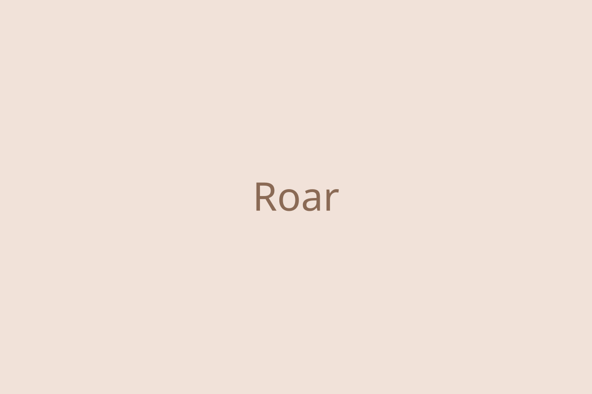

Placeholder content. Replace everything below with the real case study.

## Overview

Lorem ipsum dolor sit amet, consectetur adipiscing elit. Sed do eiusmod tempor incididunt ut labore et dolore magna aliqua. Ut enim ad minim veniam, quis nostrud exercitation ullamco laboris.

## The problem

Duis aute irure dolor in reprehenderit in voluptate velit esse cillum dolore eu fugiat nulla pariatur. Excepteur sint occaecat cupidatat non proident.

## Process

- Research and discovery
- Concepts and exploration
- Prototyping and testing
- Final design and handoff

## Outcome

Sunt in culpa qui officia deserunt mollit anim id est laborum.

<!-- Images: put files in src/assets/ and reference them relatively, e.g.
 -->
